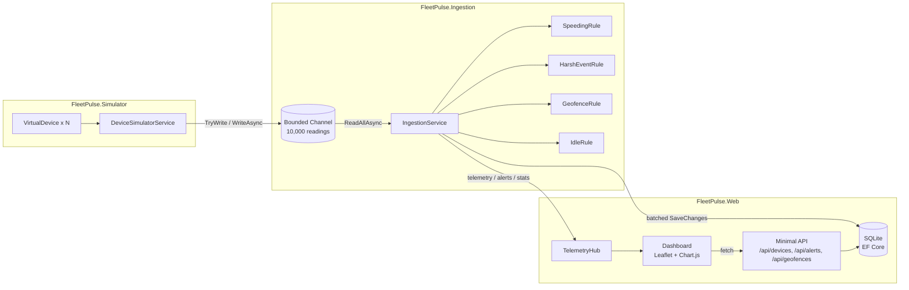

# FleetPulse — Live Fleet Telemetry Platform

FleetPulse simulates a fleet of GPS-tracked vehicles, streams their telemetry through a
backpressure-aware ingestion pipeline, evaluates it against a pluggable rule engine, persists
it, and pushes live updates to a browser dashboard over SignalR — all in a single process,
with no external infrastructure.

**Stack:** C# 14 on .NET 10 · ASP.NET Core Minimal APIs · SignalR · Entity Framework Core 10 +
SQLite · xUnit · vanilla JavaScript with Leaflet and Chart.js on the front end.

Roughly 1,600 lines of C# across six projects, plus 34 tests.

## Architecture



| Project | Responsibility |
| --- | --- |
| `FleetPulse.Core` | Domain models, `IAlertRule` abstraction, the bounded `TelemetryChannel`, and `GeoMath` (haversine distance + bearing). |
| `FleetPulse.Data` | `FleetPulseDbContext` — EF Core over SQLite, with indexes on the hot query paths. |
| `FleetPulse.Simulator` | `DeviceSimulatorService`, a `BackgroundService` driving virtual vehicles along hardcoded Toronto routes and writing readings into the channel. |
| `FleetPulse.Ingestion` | `IngestionService`, a `BackgroundService` that drains the channel, runs the rule engine, batches persistence, and broadcasts over SignalR. |
| `FleetPulse.Web` | Host process, Minimal API endpoints, SignalR hub, and the static dashboard. |
| `FleetPulse.Tests` | xUnit tests for the rule engine, geo math, and simulator physics, plus `WebApplicationFactory` integration tests. |

### Why no Docker, broker, or external database?

Everything runs as in-process `BackgroundService`s communicating over a bounded channel, with
SQLite as the datastore. That's a deliberate choice: it keeps the project trivially runnable
(`dotnet run`, nothing else to install) while still exercising the concepts a broker-based
pipeline would — producer/consumer concurrency, backpressure, batched persistence, and
real-time fan-out.

## Running it

Requires the **.NET 10 SDK**.

```bash
cd FleetPulse
dotnet restore
dotnet build
dotnet test
dotnet run --project FleetPulse.Web
```

Open the URL Kestrel prints (typically `http://localhost:5000`). You should see:

- ~60 vehicles moving along routes on a dark live map, arrows oriented to their heading
- Geofenced zones drawn as circles
- KPI strip: active devices, readings/sec, total readings, alerts, and **queue depth**
- A rolling throughput sparkline, an alert-type doughnut, and a live alert feed

`fleetpulse.db` is created on first run, seeded with three geofences, and put into WAL mode so
the ingestion writer and dashboard readers don't block each other.

### Configuration

`FleetPulse.Web/appsettings.json`:

```json
"Simulator": {
  "DeviceCount": 60,
  "TickMilliseconds": 1000
}
```

At 60 devices on a 1s tick the pipeline sustains ~60 readings/sec. Raise `DeviceCount` or drop
`TickMilliseconds` to push it — watch the **queue depth** KPI, which is the live backlog in the
bounded channel. It sits at zero while the consumer keeps up and climbs the moment it can't,
which is backpressure made visible.

### API

| Endpoint | Description |
| --- | --- |
| `GET /api/devices` | Current state of every device. |
| `GET /api/devices/{id}` | One device, or 404. |
| `GET /api/devices/{id}/history?take=200` | Recent readings, newest first. |
| `GET /api/alerts?take=100` | Recent alerts, newest first. |
| `GET /api/alerts/summary` | Alert counts grouped by type. |
| `GET /api/geofences` | Configured zones (used to draw the map circles). |
| `/hubs/telemetry` | SignalR hub pushing `telemetry`, `alerts`, and `stats` events. |

## Engineering notes

- **Bounded channel backpressure.** `BoundedChannelFullMode.Wait` means the simulator blocks
  rather than dropping data when ingestion falls behind — no unbounded memory growth.
- **Pluggable rule engine.** Rules are `IAlertRule` implementations registered as DI
  singletons. Adding an alert type means adding one class; the ingestion loop never changes.
- **Stateful rules, stateless context.** `GeofenceRule` and `IdleRule` track per-device state
  internally via `ConcurrentDictionary`, so they fire on *transitions* (entering a zone, crossing
  an idle threshold) instead of on every matching reading — and `RuleEvaluationContext` stays
  minimal.
- **Batched writes with change-tracker hygiene.** Readings and alerts are flushed in batches of
  50 or every 500ms. Because the ingestion `DbContext` lives for the life of the service, saved
  entities are explicitly detached afterwards — otherwise the change tracker grows without bound
  and every subsequent save gets slower.
- **Route-aware motion.** Progress along a route is scaled by the real haversine length of each
  leg, so a vehicle covers the correct ground distance per tick whether it's on a downtown block
  or a highway run.
- **Enums over the wire as strings.** `JsonStringEnumConverter` is registered on both the SignalR
  protocol and the Minimal API JSON options, so clients switch on `"Speeding"` rather than `0`.

## C# features used

Async streams (`IAsyncEnumerable` / `await foreach`) to drain the channel without polling,
iterator methods (`yield return`) so a rule allocates nothing when it doesn't fire, `record`
types for immutable payloads, `required` init-only properties, generic constraints on the
detach helper, nullable reference types enabled solution-wide, and file-scoped namespaces
with top-level statements throughout.
